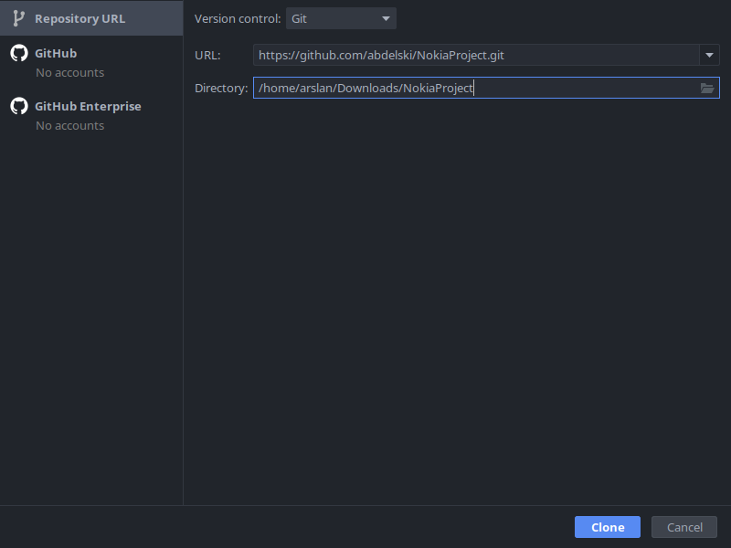
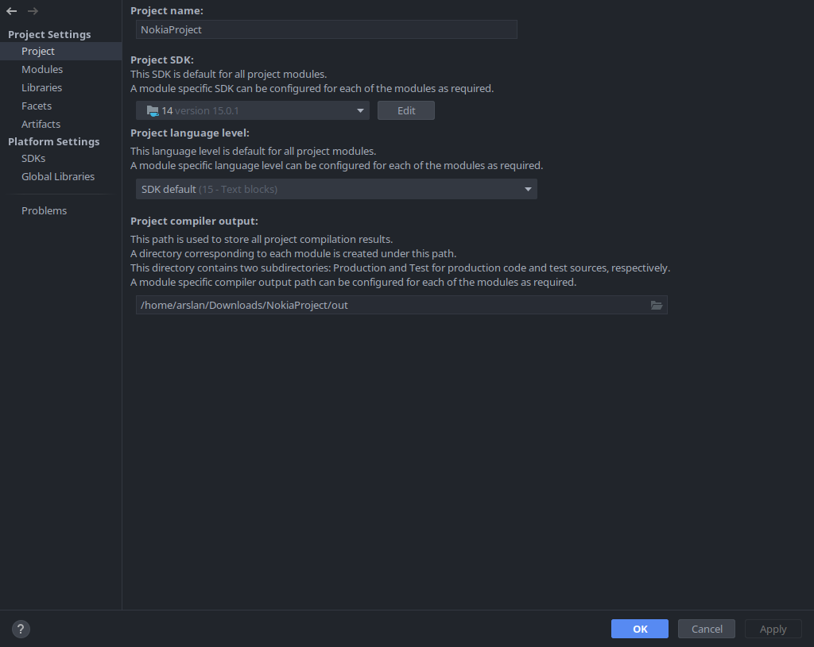
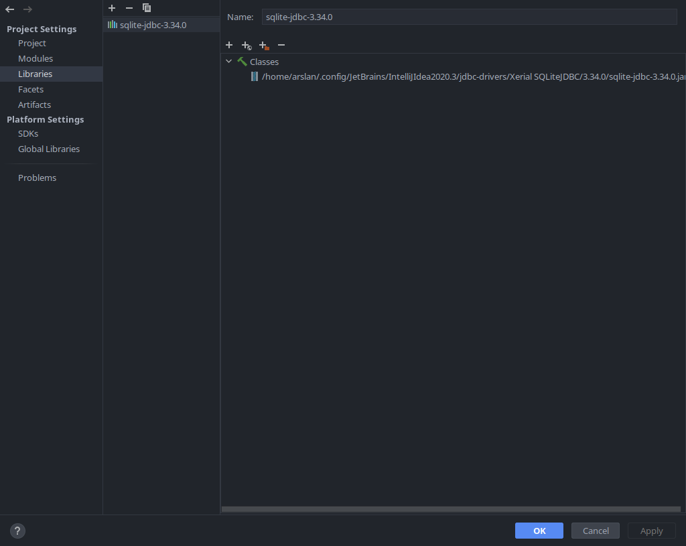

# Nokia project

## Description

Command line application for adding, deleting movies,
querying them from a database. Embedded SQLite is used via jdbc.

## Run

1. Checkout repository with Intellij IDEA

2. Open project settings  
   
Select JDK 15 or higher in Project section

Add a path to sqlite-jdbc-<vesion>.jar in Libraries section

3. Build and Run Main class
